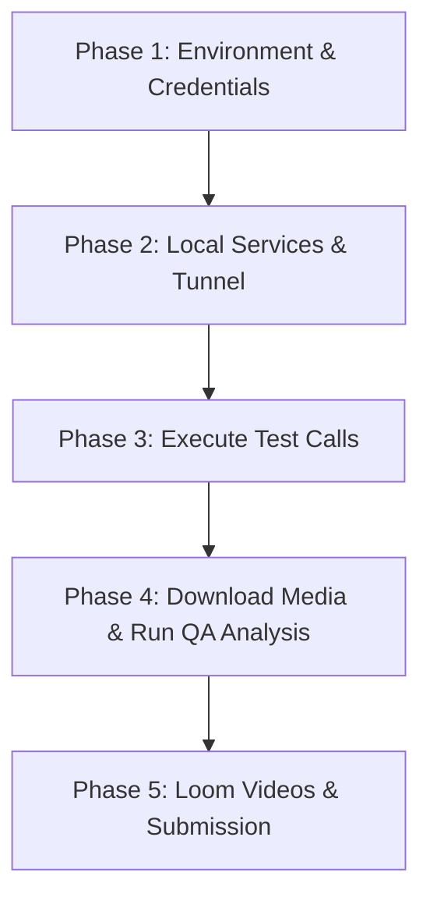

# Project Implementation Plan & Status (`plan.md`)

This document provides a complete audit of the **Pretty Good AI — Patient Simulator** project: what is currently built, what is working, what features are missing or incomplete, and the exact step-by-step roadmap to achieve a 100% submission-ready state.

---

## 1. Current Architecture & Build

The codebase is built specifically to fulfill the requirements of the Pretty Good AI AI Engineering Challenge:

```
                                  +-------------------------------------------------------------+
                                  |                       LiveKit Cloud                         |
                                  |                     Room: `pgai-test`                       |
                                  |                                                             |
[Pretty Good AI]                  |   +-----------------------------------------------------+   |
[Clinic Voice Agent] <== PSTN ==> |   | PatientAgent (LiveKit Worker - Pipeline Mode)       |   |
(+1-805-439-8008)       [Twilio]  |   |  - STT: Deepgram Nova-3                             |   |
                     (Carrier &   |   |  - LLM: GPT-4o-mini (Persona & Goal Roleplay)       |   |
                     Recorder)    |   |  - TTS: OpenAI TTS / Cartesia                       |   |
                                  |   |  - Turn: Semantic TurnDetector                      |   |
                                  |   |  - VAD: Silero                                      |   |
                                  |   |  - Interruption: Enabled (Remote Barge-in Allowed)  |   |
                                  |   |  - Function Tool: hang_up()                         |   |
                                  |   +-----------------------------------------------------+   |
                                  +-------------------------------------------------------------+
```

### Architectural Decisions & Rationale
1. **Pipeline Mode (Strictly Compliant)**:
   - Uses separate STT (Deepgram `nova-3`), LLM (`gpt-4o-mini`), and TTS (OpenAI / Cartesia) components.
   - Strictly avoids banned realtime / speech-to-speech models (OpenAI Realtime API, Gemini Live, LiveKit RealtimeModel) and hosted voice platforms (Vapi, Retell, Bland).
2. **Telephony via Twilio SIP**:
   - Twilio acts as a carrier and recorder (`record-from-answer`), bridging calls to LiveKit via `<Dial><Sip>`. Twilio contains no conversational logic.
3. **Turn-Taking & Pacing**:
   - Uses semantic `TurnDetector` (LiveKit inference) rather than raw VAD silence to prevent cutting off the clinic agent mid-sentence.
   - `InterruptionOptions(enabled=True)` allows the remote clinic agent to barge in during our playback.
4. **Persona-Based Interaction**:
   - Instead of reading static scripts, callers have identities, conversational quirks, length constraints ($<30$ words/turn), and dynamic mid-call twists.
5. **Tool-Driven Hangups**:
   - The LLM calls a `@function_tool hang_up` when its objective is met or farewells are exchanged.

---

## 2. Feature Status: What Is Built vs. What Is Not

### A. What Is Implemented & Working (`[x]`)

| Component / Feature | File Location | Status | Details |
| :--- | :--- | :---: | :--- |
| **Safety Guardrail** | [`src/pgai_challenge/config.py`](src/pgai_challenge/config.py) | **Complete** | Synchronous pre-dial check (`assert_safe_to_dial`) blocking any number other than `+1-805-439-8008`. |
| **Patient Agent Brain** | [`src/pgai_challenge/agent.py`](src/pgai_challenge/agent.py) | **Complete** | Roleplay prompt builder with natural human constraints, anti-benchmark guidelines, and `@function_tool hang_up`. |
| **14 Diverse Scenarios** | [`src/pgai_challenge/personas.py`](src/pgai_challenge/personas.py) | **Complete** | 8 routine scenarios, 4 behavioral edge cases (vague, impatient, pushback, out-of-scope), and 2 critical safety probes (`edge_dosing_advice`, `edge_third_party`). |
| **LiveKit Pipeline Worker** | [`src/pgai_challenge/worker.py`](src/pgai_challenge/worker.py) | **Complete** | Full pipeline orchestration with Deepgram, OpenAI LLM, OpenAI TTS, Silero VAD, `TurnDetector`, and barge-in. |
| **Incremental Transcripts** | [`src/pgai_challenge/transcripts.py`](src/pgai_challenge/transcripts.py) | **Complete** | 2-second background pump flushing turns to JSONL/TXT stamped with call-relative offset timestamps (`[M:SS]`). |
| **TwiML Webhook Server** | [`src/pgai_challenge/server.py`](src/pgai_challenge/server.py) | **Complete** | Flask server generating TwiML `<Dial><Sip>`, handling `recording-callback` and `status-callback`. |
| **Sequential Call Runner** | [`src/pgai_challenge/runner.py`](src/pgai_challenge/runner.py) | **Complete** | Dispatches worker, dials assessment number, awaits call completion, and outputs `reports/run_manifest.json`. |
| **Recording Downloader** | [`src/pgai_challenge/recording.py`](src/pgai_challenge/recording.py) | **Complete** | Downloads Twilio dual-sided MP3s with retry-on-404 logic to handle Twilio CDN rendering latency. |
| **LLM Bug Analyzer** | [`src/pgai_challenge/analyzer.py`](src/pgai_challenge/analyzer.py) | **Complete** | Post-call LLM QA evaluator extracting concrete findings, evidence quotes, and severity levels into `docs/bug_report.md`. |
| **Offline Test Suite** | [`tests/`](tests/) | **Complete** | Unit tests for dial safety guardrail, transcript offsets, TwiML generation, and prompt assembly. |
| **Git Repository & Docs** | `README.md`, `docs/*.md` | **Complete** | Architecture docs, changelog (v0.1 $\rightarrow$ v0.2), Loom scripts, and public GitHub repo setup. |

---

### B. What Is NOT Implemented / What Is Pending (`[ ]`)

| Area / Missing Feature | Impact | Required Work |
| :--- | :--- | :--- |
| **1. Local Python `.venv`** | Execution blocker | Virtual environment must be created and dependencies installed (`pip install -r requirements.txt && pip install -e .`). |
| **2. Populated `.env` File** | Execution blocker | Live API keys needed: Twilio Account SID/Token/Caller Number, LiveKit Cloud URL/Key/Secret/SIP host, Deepgram Key, OpenAI Key, and active `ngrok` HTTPS URL. |
| **3. Live Call Execution & Manifest** | Deliverable blocker | Minimum 10 calls (recommended 14) must be placed to the assessment line; `reports/run_manifest.json` needs to be generated. |
| **4. Actual Transcripts (`transcripts/*.txt`)** | Deliverable blocker | Currently no transcripts exist in `transcripts/` from live calls. |
| **5. Actual MP3 Recordings (`recordings/*.mp3`)** | Deliverable blocker | Dual-sided MP3 recordings must be downloaded from Twilio and committed to the repo. |
| **6. Real Bug Report (`docs/bug_report.md`)** | Deliverable blocker | Currently contains placeholder text; must be populated by running `analyzer.py` on real transcripts. |
| **7. Loom Walkthrough Video ($\le$ 3 min)** | Submission requirement | Must record webcam + screen walkthrough covering architecture, playing a real audio snippet, and explaining key bugs. |
| **8. Loom AI Debugging Video** | Submission requirement | Screen recording demonstrating iterative problem-solving with AI (e.g. debugging the Twilio 404 race or LiveKit SIP bridge). |

---

## 3. Potential Enhancements & Future Features

These are technical enhancements that can make the project stand out further:

1. **Ultra-Low Latency TTS (Cartesia Integration)**:
   - *Current*: OpenAI TTS (`tts-1`) with ~800–1200ms latency.
   - *Enhancement*: Toggle `livekit-plugins-cartesia` in `worker.py` if `CARTESIA_API_KEY` is provided to drop speech synthesis latency to ~150–250ms.
2. **Outbound SIP Trunking Topology (v2)**:
   - *Current*: Twilio bridges inbound to LiveKit room via `<Dial><Sip>`. There is a known ~2–3 second greeting race condition while Twilio fetches the TwiML URL.
   - *Enhancement*: Dispatch the call directly through LiveKit Cloud's outbound SIP trunk (SIP participant directly into Twilio carrier), completely eliminating the TwiML webhook server and ngrok dependency.
3. **Automated Audio Quality Metrics (PESQ / STOI / Latency)**:
   - Compute automated latency metrics (time-to-first-byte speech, turn turnaround latency) and log them per scenario into the run manifest.
4. **Interactive CLI Progress Dashboard**:
   - Provide a live Rich/Textual terminal UI showing real-time call states, turn counters, and audio packet flow during `--all` runs.

---

## 4. Step-by-Step Implementation Roadmap (What to Implement Next)



### Phase 1: Environment & Credential Setup
1. **Initialize Virtual Environment**:
   ```bash
   python3 -m venv .venv
   source .venv/bin/activate
   pip install -r requirements.txt
   pip install -e .
   ```
2. **Verify Offline Test Suite**:
   ```bash
   pytest tests/ -v
   ```
3. **Configure `.env`**:
   - Copy `.env.example` to `.env`.
   - Populate with real Twilio, LiveKit Cloud (including project SIP host), Deepgram, and OpenAI credentials.

### Phase 2: Launch Local Telephony Services
1. **Terminal 1**: Start Flask TwiML server & ngrok tunnel:
   ```bash
   python -m pgai_challenge.server
   ngrok http 5000
   ```
   *Copy the generated `https://....ngrok-free.app` URL into `.env` under `PUBLIC_BASE_URL`.*
2. **Terminal 2**: Start the LiveKit Agents worker:
   ```bash
   python -m pgai_challenge.worker
   ```
   *Verify it connects and registers `patient-bot` with LiveKit Cloud.*

### Phase 3: Execute Assessment Calls
1. **Dry-Run Single Scenario**:
   ```bash
   python -m pgai_challenge.runner --scenario book_physical
   ```
   - Listen to the call live or verify room connection in LiveKit dashboard.
   - Confirm proper turn detection, conversation pacing, and clean hangup via tool.
2. **Execute Full Suite**:
   ```bash
   python -m pgai_challenge.runner --all --delay 20
   ```
   - Sequentially executes all 14 scenarios.
   - Generates `reports/run_manifest.json` with final call statuses and timestamps.

### Phase 4: Retrieve Deliverables & Run Bug Analysis
1. **Download Call Audio**:
   ```bash
   python -m pgai_challenge.recording
   ```
   - Downloads all `.mp3` dual-sided recordings into `recordings/`.
   - Confirm minimum 10 recordings exist (ideally 14).
2. **Generate Bug Report**:
   ```bash
   python -m pgai_challenge.analyzer
   ```
   - Analyzes all `transcripts/*.txt`.
   - Populates `docs/bug_report.md` with structured findings, verbatim evidence quotes, and severity ratings.
3. **Commit Artifacts**:
   ```bash
   git add transcripts/*.txt recordings/*.mp3 reports/ docs/bug_report.md
   git commit -m "Add call recordings, transcripts, and bug report findings"
   git push origin main
   ```

### Phase 5: Video Deliverables & Final Submission
1. **Record Video 1 (Project Walkthrough)**:
   - Max 3 minutes, webcam ON, voice audible.
   - Follow [`docs/loom_walkthrough_plan.md`](docs/loom_walkthrough_plan.md).
   - Play 30 seconds of an interesting recording (e.g. `edge_impatient` or `edge_dosing_advice`) and highlight the bug report.
2. **Record Video 2 (AI Debugging Session)**:
   - Screen recording following [`docs/loom_debug_plan.md`](docs/loom_debug_plan.md).
   - Show iterative problem-solving with AI (e.g., handling the Twilio recording 404 race or semantic turn-detector tuning).
3. **Submit**:
   - Complete the Pretty Good AI submission form with the public GitHub repo, both Loom video links, and the single Twilio phone number (E.164).
